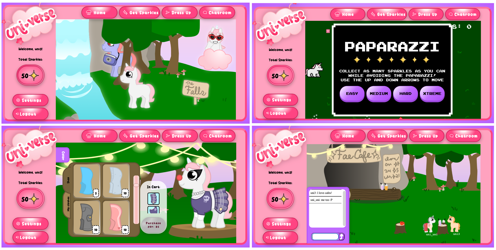

# 🦄 Welcome to the Uni-verse!


A capstone project for Macalester College's COMP 446 by [Cecelia Kaufmann](https://github.com/cecelia-kaufmann1), [Lucy Rubin](https://github.com/lucyrubin), and [Linda Lor](https://github.com/LindaLor028)

This interactive web application takes you into the world of unicorns, with the main goal of the unicorn being outrunning the paparazzi to collect sparkles! Then, go spend those sparkles at the store to show off to all your friends! Finally, go chat with other unicorns while you are dressed in your finest attire. 

This project uses the Django Framework to host the login and then a separate server to host the multiplayer/chatroom feature, which is then embedded within the wesbite. The game utilizes the Phaser Framework, and we also used Ajax for asychronous loading. For the front-end framework, we used HTML, CSS, and Javascript. 

## 🛠 How To Install Uni-verse:
After cloning the above repository, here are the steps to get the uni-verse up and running. Please run these commands below. Running this command will download all of the software needed for the application to run. 

### Mac Step by Step to Install:
First, ensure that you have the most up to date Python, which should be Python 3. Before begnning this process, you will want to be in the terminal and you will want to cd into the project directory.

**Step 1:** In the terminal, run "pip3 install -r requirements.txt" 
```
pip install -r requirements.txt
```

**Step 2:** Then, create a virtual environment by typing "pip install virtual env" in the terminal. 
```
pip install virtual env
```
Once this is run, create the virtual environment and activate it: 
```
python3 -m venv venv
source venv/bin/activate
```
**Step 3:** Next, change your directory to be loginscreen:
```
cd loginscreen/
```
While in this directory, run the server with "python3 manage.py runserver"
```
python3 manage.py runserver
```
At this point, Django will print out a url in the terminal. If you go to that url, the website should be running (with an exception to the chatroom). 

**Step 4:** To run the chatroom, we need to open a second terminal. Once the second terminal is opened, cd into the project, and install "npm install express". 
```
npm install express
```
**Step 5:** Then run "node server.js" (this will activate the second server for the chat room). 
```
node server.js
```
**Step 6:** And you are done!! Take the link in the first terminal (step 3) and put it into your browser. From there, you should be able to go into the Uni-verse! When you are done, Ctrl + C to break and then type "deactivate" to deactivate the virtual environment. 

### Windows Step by Step to Install:
First, ensure that you have the most up to date Python, which should be Python 3. Before begnning this process, you will want to be in the terminal and you will want to cd into the project directory. \
**Step 1:** In the terminal, run pip install -r requirements.txt 
```
pip install -r requirements.txt
```
**Step 2:** Then, run pip install virtualenv.
```
pip install virtualenv
```
Once installed, create the virtual environment and activate it: 
```
virtualenv --python uni-versecomp446 venv
.\venv\Scripts\activate
```
**Step 3:** Next, change your directory to be loginscreen. While in this directory, run the server with "python manage.py runserver"
```
python manage.py runserver
```
At this point, Django will print out a url in the terminal. If you go to that url, the website should be running (with an exception to the chatroom). 


**Step 4:** To run the chatroom, we need to open a second terminal. Once the second terminal is opened, cd into the project, and install "npm install express". 
```
npm install express
```
**Step 5:** Then run "node server.js" (this will activate the second server for the chat room). 
```
node server.js
```

**Step 6:** And you are done!! Take the link in the first terminal (step 3) and put it into your browser. From there, you should be able to go into the Uni-verse! When you are done, Ctrl + C to break and then type "deactivate" to deactivate the virtual environment. 


## 📝 Credits:
In this section, some things we credit will be based on file names. Note that these names may differ greatly from their original file name and had to be renamed for semantic reasons. 
### Art Assets
**Unicorn Base and Clothing Assets:** [Linda Lor](https://github.com/LindaLor028), [Lucy Rubin](https://github.com/lucyrubin) \
**Dress Up Backdrop:** [Linda Lor](https://github.com/LindaLor028) \
**Get Sparkles Tileset:** [Lucy Rubin](https://github.com/lucyrubin) \
**Get Sparkles Sprites:** [Linda Lor](https://github.com/LindaLor028), [Lucy Rubin](https://github.com/lucyrubin)

### Audio & Sound Effects
**8bitpaparazzi.mp3:** [TheQuinnDruRocks Hard ](https://www.youtube.com/watch?v=V0ZvdCeIPzM&ab_channel=TheQuinnDruRocksHard)\
**Get Sparkles Game Transition:** [Pixabay](https://pixabay.com/sound-effects/?utm_source=link-attribution&utm_medium=referral&utm_campaign=music&utm_content=6104)\
**countdown.mp3:** [Lesiakower](https://pixabay.com/sound-effects//?utm_source=link-attribution&utm_medium=referral&utm_campaign=music&utm_content=151797)\
**gameOver.mp3:** [Pixabay](https://pixabay.com/?utm_source=link-attribution&utm_medium=referral&utm_campaign=music&utm_content=38507)\
**Litte_Apprentice.wav:** [Tim Beek](https://soundcloud.com/timbeek/little-apprentice)\
**friday_afternoon.wav:** [Tim Beek](https://soundcloud.com/timbeek/little-apprentice)\
**monday_morning.wav:** [Tim Beek](https://soundcloud.com/timbeek/little-apprentice)\
**waterfall.wav:** [InspectorJ](https://freesound.org/people/InspectorJ/sounds/365919/)\
**draw_pull_out.wav:** [Garuda1982](https://freesound.org/people/Garuda1982/sounds/561406/)\
**tick.wav:** [el_boss](https://freesound.org/people/el_boss/sounds/628638/)\
**equip.wav:** [alegemaate](https://freesound.org/people/alegemaate/sounds/667271/)\
**purchase.mp3:** [kiddpark](https://freesound.org/people/kiddpark/sounds/201159/)\
**camera_shutter.m4a:** [roachpowder](https://freesound.org/people/roachpowder/sounds/170229/)\
**Confirm.wav:** [jdwasabi](https://jdwasabi.itch.io/8-bit-16-bit-sound-effects-pack)


### User Interface (CSS & Images) 
Button & Containers Design: [Lucy Rubin](https://github.com/lucyrubin)\
Home Backdrop Image: [Linda Lor](https://github.com/LindaLor028)\
Rainbow Icon: [hiclipart](https://www.hiclipart.com/free-transparent-background-png-clipart-itxob/download)\
Universe Logo: [Linda Lor](https://github.com/LindaLor028)\
**HTML and CSS for the 8bit style container:** [robdimarzo](https://codepen.io/robdimarzo/pen/eYWmxKr)\
**HTML and CSS for video game style buttons:** [reulison](https://codepen.io/reulison/pen/WNNVPZq)

### Code Resources and Demos
[Virtual Environment Set Up](https://mothergeo-py.readthedocs.io/en/latest/development/how-to/venv-win.html)\
[Accessibility Resource](https://www.siteimprove.com/glossary/accessible-fonts/#:~:text=The%20most%20accessible%20fonts%20are,also%20considered%20to%20be%20accessible.)\
[Django Login/Login Database Tutorial](https://learndjango.com/tutorials/django-login-and-logout-tutorial)\
[Django User Authentication Tutorial](https://developer.mozilla.org/en-US/docs/Learn/Server-side/Django/Authentication)\
[Positioning/parenting the phaser canvas](https://phaser.discourse.group/t/how-do-i-move-phaser-game-to-the-center-of-a-browser/8577)\
[Removing border form iframe](https://stackoverflow.com/questions/65034/remove-border-from-iframe)\
[Custom scrollbar from Eye Catching Scrollbar #4](https://css-tricks.com/classy-and-cool-custom-css-scrollbars-a-showcase/)\
[Tag Inputs](https://www.w3schools.com/tags/tag_input.asp)\
[Setting up mulitplyer server](https://gamedevacademy.org/create-a-basic-multiplayer-game-in-phaser-3-with-socket-io-part-1/#Setting_up_the_server)\
[Handling TypeError, Listen](https://stackoverflow.com/questions/64923775/typeerror-require-listen-is-not-a-function)\
[Disconnecting a socket](https://www.dynetisgames.com/2017/03/06/how-to-make-a-multiplayer-online-game-with-phaser-socket-io-and-node-js/ )\
[Sending messages to iframe](https://javascriptbit.com/transfer-data-between-parent-window-and-iframe-postmessage-api/)\
[Virtual Environment and Requirements.txt file](https://mothergeo-py.readthedocs.io/en/latest/development/how-to/venv-win.html)\
[Customize font in phaser](https://learn.yorkcs.com/2019/09/28/phaser-3-basics-custom-fonts/)\
[User Permissions for audio](https://stackoverflow.com/questions/60427633/how-to-ask-audio-autoplay-permission-in-the-browsersafari-with-javascript)\
[Volume control for AudioBuffer](https://stackoverflow.com/questions/43386277/how-to-control-the-sound-volume-of-audio-buffer-audiocontext)


